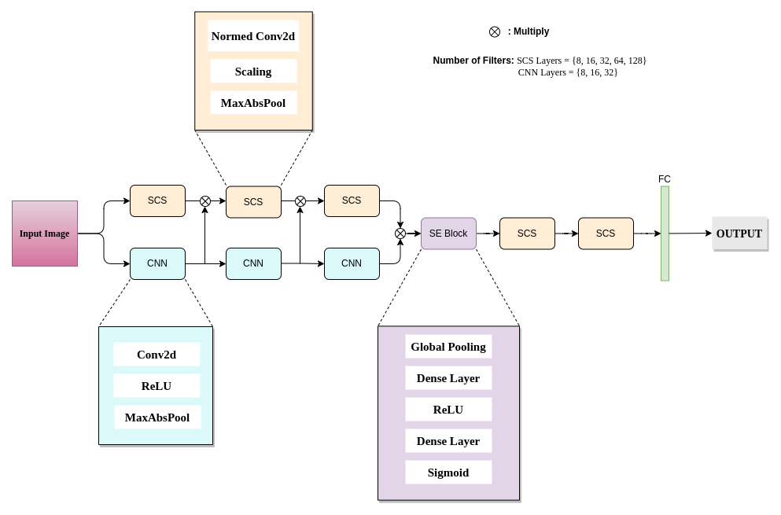
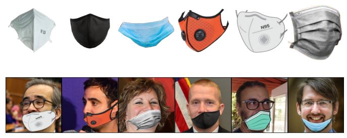

# SCS-Net: An efficient and practical approach towards Face Mask Detection
[Umar Masud](https://umar07.github.io), Momin Siddiqui, Mohd. Sadiq, Sarfaraz Masood

---
[](https://www.sciencedirect.com/science/article/pii/S1877050923001655)


This repository contains the official PyTorch implementation of <i>**SCS-Net: An efficient and practical approach towards Face Mask Detection**</i>. SCS-Net is a lightweight deep learning model with just 0.12M parameters which is a reduction of upto 496 times as compared to the state-of-the-art models designed for the task of facial mask detection. 

<p align="center">
  
</p>

---

## Dataset
[](https://www.kaggle.com/datasets/mominsiddiqui/enhancedfmld20)

We also provide a new dataset - <i>Enhanced FMLD 2.0</i>, which contains a large set of **25,296 synthetically designed incorrect face mask images**. It is the first of its kind of data to be proposed with equal diversity and quantity. The data can be downloaded from [Kaggle](https://www.kaggle.com/datasets/mominsiddiqui/enhancedfmld20).


<p align="center">
  
</p>

## Citation
If you use this work for research or project purposes, then please credit the authors.


### Bibtex
```
@article{MASUD20231878, 
title = {SCS-Net: An efficient and practical approach towards Face Mask Detection}, 
journal = {Procedia Computer Science}, 
volume = {218}, 
pages = {1878-1887}, 
year = {2023}, 
note = {International Conference on Machine Learning and Data Engineering}, 
issn = {1877-0509}, 
doi = {https://doi.org/10.1016/j.procs.2023.01.165},
author = {Umar Masud and Momin Siddiqui and Mohd. Sadiq and Sarfaraz Masood}, }
```

## Acknowledgement
We refer to code modules of [SCS-Layer](https://github.com/brohrer/sharpened-cosine-similarity) and [SE-Net](https://github.com/moskomule/senet.pytorch) for our work. Thanks to their awesome work!